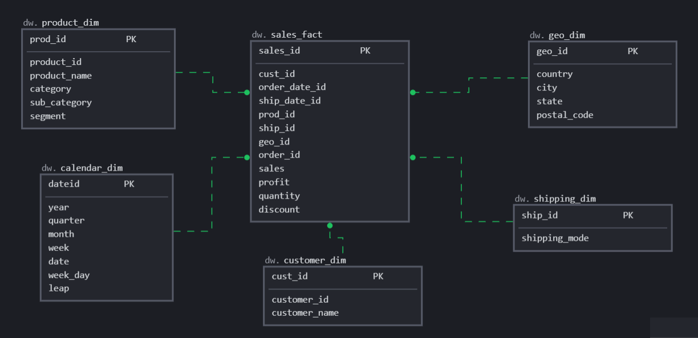
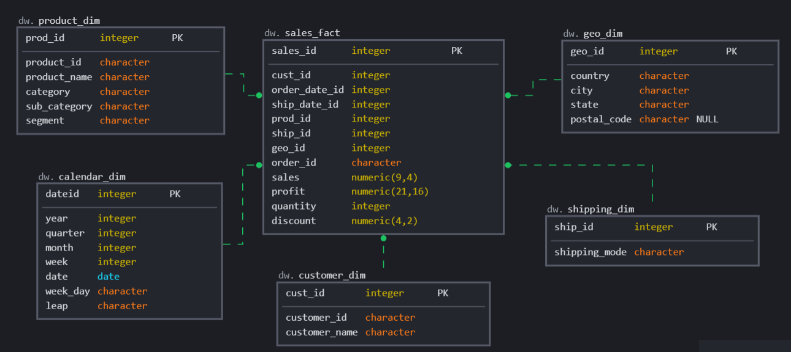

# Проекты модуля 2

## 1. Установка Postgres.
Установлен Postgres и pgAdmin ранее в курсе DataLearn - SQL
## 2. Подключение к БД, загрузка данных в БД, SQL запросы
Загрузка выполнена использованием предоставленных примеров файлов и исправлений к ним:
- Таблица [Orders](./2_3_orders.sql)
- Таблица [People](./2_3_people.sql)
- Таблица [Returns](./2_3_returns.sql)

Запросы SQL к базе для ответов на вопросы из модуля 1:
-  Запросы SQL [Superstore](./2_3_3_superstore.sql)
## 3. Модель данных в SQLdbm для создания новой БД

- Концептуальная 
- Логическая 
- Физическая 
