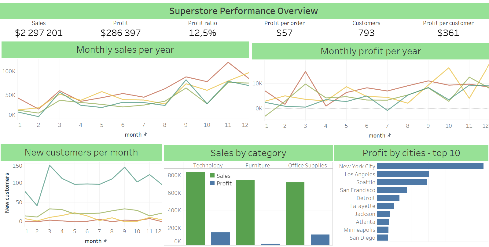
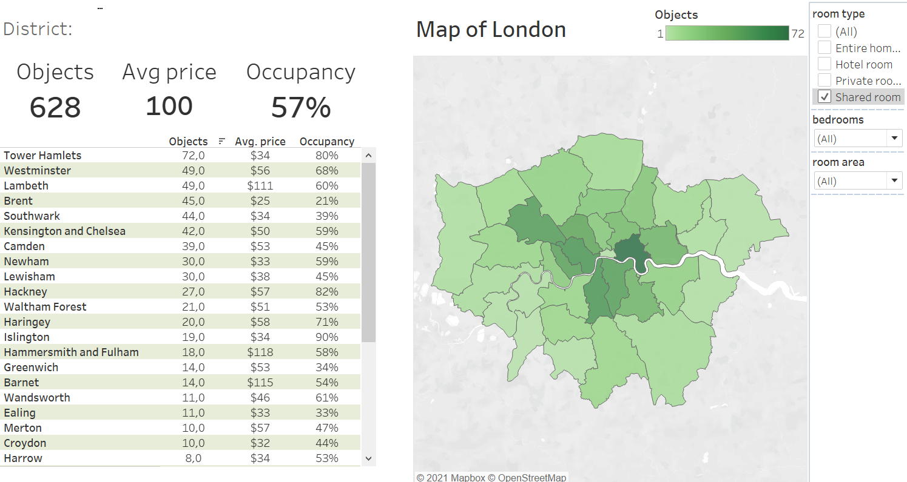

# Проекты модуля 3

## 1. Установка Tableau Desktop.
Установлен Tableau Desktop и получена лицензия.
## 2. Подключение к БД Postgres, построен дашборд Superstore. 
 
 [Дашборд Tableau Public](https://public.tableau.com/views/MySuperstore_16329379007340/Dashboard1)

## 4. Подключение к виртуальной машине.
Failed (((

## Capstone project

[Дашборд в Tableau Public]( https://public.tableau.com/views/airbnb_16332740965890/Dashboard)
